<!-- ============================================================
  ⛏️ MINECRAFT PROFILE README — for github.com/sai-pa416
  ============================================================
  HOW TO USE:
  1. Fill in everything marked with ✏️
  2. Push this README.md to a repo named exactly: sai-pa416/sai-pa416
  3. Your profile page will show it instantly (see SETUP.md)
============================================================ -->

<!-- 🎨 ANIMATED BANNER (SVG — animates in your browser) -->

  

<!-- 🏷️ NAME + TYPING ANIMATION (Press Start 2P pixel font) -->

---

<!-- 🏝️ ABOUT ME -->
## 🏝️ About Me

> "Not all who wander are lost... some are just looking for diamonds."

- 🧱 **Block**: I build software like Minecraft — one block at a time, breaking things until they work
- 🎮 **Currently playing**: Real life survival mode (hard difficulty)
- 📍 **Location**: The Overworld 🌍
- 💼 **Working on**: My very first GitHub repos
- 🌱 **Learning**: How to not fall into lava — and a few coding languages
- 💬 **Ask me about**: My favorite Minecraft seeds (coding skills loading...)
- ⚡ **Fun fact**: I spend more time optimizing my dotfiles than actually coding

---

<!-- ⛏️ PLAYER STATS -->
## ⛏️ Player Stats

  
  
  

<!-- 🗺️ MINING MAP (activity graph) -->
## 🗺️ Mining Map

---

<!-- ⚔️ SKILLS / XP BARS (animated SVG) -->
## ⚔️ Skills & XP Bars

  

---

<!-- 📦 PROJECTS SHOWCASE
     Uncomment the lines below once you have repos.
     Replace REPO_NAME with each repository name.
     You can repeat the  block for up to 6 projects.
-->
## 📦 Crafted Items (Projects)

> I've only just spawned... my inventory is still loading. 🎒
> Drop your expectations, I'm crafting my first tools!

<!--

  

-->

---

<!-- 📰 BLOG + RECENT ACTIVITY -->
## 📰 Knowledge Books (Blog & Activity)

<!-- ✏️ EDIT: To show your Medium posts, replace YOUR_MEDIUM_USERNAME in the two
     lines below, then delete the <!-- --> comment wrapper around them. -->

<!--
**Recent Medium posts:**

> Have your own blog with an RSS feed? Add it right here:
> `[Latest posts](https://your-blog.com/feed.xml)` — for auto-updating posts, check out [rss-readme](https://github.com/jasonk24/rss-readme).
-->

---

<!-- 📮 CONTACT / PLAYER LIST -->
## 📮 Contact — Add me on your server

  ✉️ Coming soon — my coordinates are still being generated...

<!-- 👀 PLAYERS ONLINE (visitor counter) -->

  

---

<!-- 🎮 END SCREEN -->

  

  <b>Thanks for visiting! 🟩⬛🟫 Stay safe — watch out for creepers. 💥</b>

  ⛏️ Crafted with ⬛🟨🟩 in the deep caves of GitHub

