<!-- ════════════════════════════════════════════════════════════
   ONE PIECE PROFILE — github.com/sai-pa416
   ✏️ 1) Edit your name / role / bio in the sidebar below.
   ✏️ 2) Update the Devil Fruit powers (skills) to your real stack.
   ✏️ 3) Add Pinned Repo cards once you have repositories.
   ════════════════════════════════════════════════════════════ -->

<!-- 🏴‍☠️ BANNER — animated One Piece scene -->
<p align="center">
  <video controls width="900" src="https://raw.githubusercontent.com/sai-pa416/sai-pa416/main/ONEPIECE.mp4"></video>
</p>

# sai-pa416

<!-- 👒 SIDEBAR + STATS DASHBOARD -->
<table>
  <tr>
    <td width="40%" align="center">
      <b>sai-pa416</b>
      <br/>
      <sub>Software Developer · Straw Hat Crew</sub>
      <br/>
      <sub>I'm gonna be the King of the Developers!</sub>
      <br/><br/>
      
      <br/>
      
      <br/>
      
      <br/>
      
    </td>
    <td width="60%" align="center">
      
      <br/><br/>
      
    </td>
  </tr>
</table>

<!-- 🗺️ GRAND LINE MAP (contribution heatmap) -->
## 🗺️ Grand Line Map

<p align="center">
  
</p>

<!-- ⚔️ DEVIL FRUIT POWERS (skills) -->
## ⚔️ Devil Fruit Powers

<p align="center">
  
  
  
  
  
  <br/>
  
  
  
  
  
</p>

<!-- 📌 PINNED REPOSITORIES -->
## 📌 Straw Hat Fleet (Pinned Repos)

> Still recruiting crew members... my fleet is just setting sail! 🚀

<!--
  Add pinned cards once you have repos:
  <p align="center">
    <a href="https://github.com/sai-pa416/REPO_NAME"></a>
  </p>
  (add a "Generate pin card" step to .github/workflows/update-cards.yml)
-->

<!-- 📜 BOUNTY LOG (recent activity) -->
## 📜 Bounty Log (Recent Activity)

> - 🎯 Pushed commits to `sai-pa416/sai-pa416` — set sail
> - 🎨 Restyled README — One Piece theme
> - ⚙️ Workflow ran — refreshed stats

<details>
  <summary><b>Marine transmission log</b></summary>

  ```
  [15:04] ✔ workflow_dispatch  update-cards.yml  main
  [14:02] ✔ push  main  Set sail
  [12:30] ✔ push  main  First bounty posted
  ```

</details>

---

<p align="center">
  <sub>🏴‍☠️ One Piece × Code · Zolo-level determination, no bugs on my Grand Line</sub>
</p>